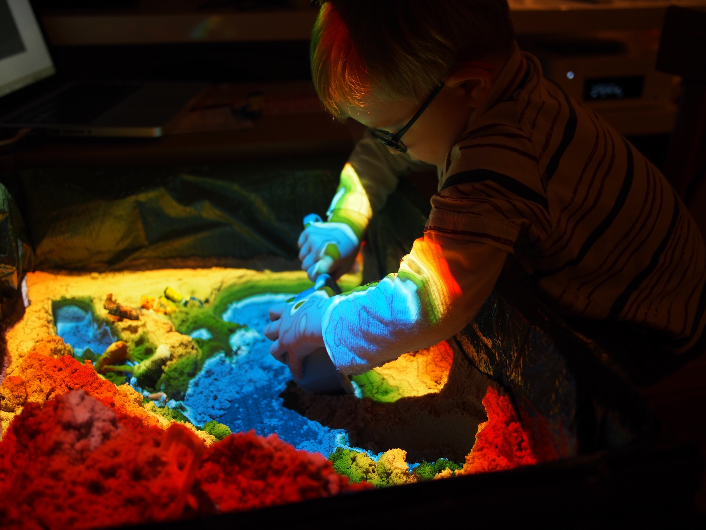
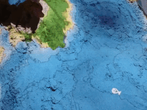

# Magic Sand
Magic Sand is a software for operating an augmented reality sandbox like this one:



An augmented reality sandbox is made of a sand box, a depth detector (like a Kinect) and a beamer coupled together. The software provided on this repository control the beamer and the kinect in order to project on the sand colors which are related to the height of the sand.

This project was inspired and adapted from the [Augmented Reality Sandbox](https://arsandbox.ucdavis.edu) developped by [UC Davis](http://idav.ucdavis.edu/~okreylos/ResDev/SARndbox/). It is a partial port of the [SARndbox](https://github.com/KeckCAVES/SARndbox) project of Oliver Kreylos under [openframeworks](http://openframeworks.cc/) and is also adapted from the [ofxKinectProjectorToolkit](https://github.com/genekogan/ofxKinectProjectorToolkit) by Gene Kogan.

It was ported to openFrameworks with multi-plateform support (linux/macos/windows), a simple user interface and a robust yet simple calibration procedure by [Thomas Wolf](https://thomwolf.io) and later modified and extended with some games by [Rasmus R. Paulsen](http://people.compute.dtu.dk/rapa).



Magic-Sand was developed with the specific aim of simplifying the use of an augmented reality sandbox in a home/family environment :
- run on a mid-range laptop / home computer (Windows / Mac OS X / Linux, minimal GPU requirement).
- Easy calibration to easily disassemble and reassemble the sandbox.
- simple, easy-to-use interface.
- framework for future sandbox-based games and applications.


## Main Features

Operates on a computer connected to a home cinema projector and a kinect sensor.
The software controls the projector to project colors as a function of the sand level measured by the kinect sensor and transforms a sandbox in a colorful playground.


## Getting started

The easiest way to get started is to build the physical setup provided in the guide found at the [tutorial page](https://imgur.com/gallery/Q86wR) and/or check the [reddit thread](https://www.reddit.com/r/DIY/comments/4v1gfi/a_magic_sandbox_i_made_for_my_3_yo_sons_birthday/)

Secondly, download and install/unpack the latest ready-to-use version of the software at the [release page](https://github.com/thomwolf/Magic-Sand/releases/latest). Follow the instructions on the release page to download and install the necessary drivers.

### Setting up the system

Connect and turn on the projector and the kinect and start the software.

By default the software starts in a **setup** mode where the depth or color image from the Kinect can be seen in the user interface and the projector projects a completely white image. This way it is easy to check if the Kinect is running (on Windows 10 machines it can be necessary to plug and unplug the Kinect several times before it starts) and if the projector is working. The status of the kinect and the projector can be seen in the status window to the lower left in the user interface.

In **setup** mode the physical positions of the Kinect and projector can be optimised. 

### Calibration

To calibrate the system so the kinect and the projector is in correspondence a few steps are needed:
- Flatten the sand in the sand box.
- Make sure that you see either the depth image or the color image from the Kinect (click **advanced|Display Kinect Depth View**)
- Press **Calibration|Manually Draw Sand Region** 
- Define the sand region by drawing a rectangle with the mouse on the Kinect Depth or Color view
- Press **Automatically Calibrate Kinect & Projector** - a series of Chessboard patterns are now projected  on the sand.
- When a prompt appears cover the sand box with a light piece of cardboard or similar
- Press ok -  a series of Chessboard patterns are now projected on the cardboard/plate.

If the calibration is succesful the status window should be updated showing that all is ok.


#### Debug mode for calibration
If the calibration was not succesful a debug mode can be enabled that will place debug files in the **data\DebugFiles** folder. These might point you in the direction of why the calibration failed. Do this by enabling **advanced|Dump Debug** and run the calibration routine again.

## Starting the Application
If the calibration was succesful or if a calibration was done before, the application can be started by pressing space or pushing the **Run** button.

Now a colored map with iso-lines should appear on the sand. The framerate should be close to 60 FPS for modern PCs.

## Sandbox games

There are a few games included in Magic-Sand

### Shape an Island 
The background for the game is that Denmark have more than [400 Islands](https://en.wikipedia.org/wiki/List_of_islands_of_Denmark) and we wanted to create a game that could teach people about islands. We added a few non-Danish Islands as well.
The aim of the game is to shape an Island that matches a given Island. Only the outer contour of the Island is compared (not the height). The game is played like this:

- Press **space** to start the game - now a welcome screen appear
- Shape a big island in the middle of the box (you have 30 seconds). It must NOT be connected to the edge of the box.
- The application will check if an Island exists and if not will let you try again
- Now a name of a given Island is given and you are to shape that specific Island (Australia for example)
- After 30 seconds the application will match your Island with the given Island and show you the results and a score
- Now you have 1 minute to reshape your Island
- Yet another intermediate results will be shown
- Now you have 30 seconds to finalise your Island
- A final result is computed and your score is compared to the overall high-score

It is possible to add more Islands.  Instructions will be added later.

This game was used in an educational event at the Danish Island Bornholm as seen in this [video](https://www.youtube.com/watch?v=dDMrxtH1hyU).

This game was mainly developed by Rasmus R. Paulsen. 

### The Sandimals 2-player game
In this game the box is divided into two halfes where each player is only allowed to move the sand in his half. The goal is collect as much **food** and as many **skins** as possible in **5 minutes**. You get **skins** by having rabbits on your half and you get **food** by having fish on your half. The more rabbit the more skins per second. The more and bigger fish the more food per second.

Before starting the game you should flatten the sand and shape a big lake in the middle of the box.

The game is started by pressing **f** on the keyboard. After 5 minutes the game stop and the player who has the most **food+skins** wins the game.

You can also start the game by pressing **1** (complete beginner), **2** (novice), **3** (standard) and **4** (expert).

The behaviour of **fish**:
- fish are light gray
- there is always a fixed number of fish (10, 20, 30 depending on level) in the box
- their speed is determined by their size
- they move in flocks
- they flee from sharks (they will get a **red** center)
- they have a limited life-span (they have a **grey** center when they are soon dying)
- they respawn at the current mother fish 
- if a fish is eaten by a shark it respawns as a baby fish by the current mother fish
- the mother fish has a **pink** center
- the current mother fish is the oldest fish in the box
- if a fish ends on land it will seek downwards to find water 

The behaviour of **sharks**:
- the shark is white
- there is always 2 sharks in the box
- they move slow and have a **white** stomach when they are well fed 
- they get a **black** stomach when they are hungry but not hunting
- they get a **red** stomach when they are hunting and will move fast
- there is a chance they will start hunting when they are hungry
- they will hunt the biggest fish that are close to them
- if they catch the fish they eat it and their hunger decrease. 
- if the hunger get too much (if they are trapped) they will die
- if a shark die a new shark respawns
- a shark respawns where there is the highest density of fish
- if they end on land they will seek downwards to find water 

The behaviour of **rabbits**:
- there is always a fixed number (4, 6 or 10 depending on level) of rabbits in the box
- they move and stop
- they live on land

Fish and sharks can be taken and moved using your hands if you shape them like a bowl. 

This game was mainly developed by Rasmus R. Paulsen.

### The animal and their mothers game

A mother fish and a mother rabbit can be enabled. The user can help the animals to reach their mothers by digging rivers or building mountains in the sand.

The game is started by pressing **m** on the keyboard.

This game was mainly developed by Thomas Wolfe.

## Coding and Extending Magic Sand

### Source Code
The full source code for Magic Sand is available on [github.com/thomwolf/Magic-Sand](https://github.com/thomwolf/Magic-Sand). 


### Dependencies
Magic Sand is based on [openframeworks](http://openframeworks.cc/) release 0.9.3 and makes use of the following addons:
- official addons (included in openframeworks 0.9.3)
  * ofxOpenCv
  * ofxKinect
  * ofxXmlSettings
- community addons:
  * [ofxCv](https://github.com/kylemcdonald/ofxCv)
  * [ofxParagraph](https://github.com/braitsch/ofxParagraph)
  * [ofxDatGui (forked version)](https://github.com/thomwolf/ofxDatGui)
  * [ofxModal](https://github.com/braitsch/ofxModal)

### Quick start for editing the source code
- Grab a copy of [openframeworks](http://openframeworks.cc/download/) for your OS.
- Unpack the Magic-Sand in the **app/myApps** folder in the openframeworks directory tree
- Grab the additionnal community addons listed above. They should be installed in the **addons** subdirectory of openframeworks
- If you are a windows user, install the kinect drivers as detailed on the [release page](https://github.com/thomwolf/Magic-Sand/releases/latest)
- Enjoy ! (Xcode / VS2015 project files are supplied, should work also on linux)

Be sure to check the [openframeworks](http://openframeworks.cc/) documentation and forum if you don't know it yet, it is an amazing community !

### How it can be used
The code was designed trying to be easily extendable so that additional games/apps can be developed on its basis.

Note that some of the below descriptions are slightly out-of-date.

The `KinectProjector` class handles the communication with the kinect sensor, the calibration and the coordinates conversions between kinect (2D), world (3D) and projector (2D) coordinate systems.

You can create a `KinectProjector` object as a `shared_ptr` in the `setup()` function of your openframeworks app. It requires a pointer to the projector window (see provided `main.cpp` on how to properly setup two windows in openframeworks and get a pointer to the projector window).

The `kinectProjector` object can be shared among the various objects that need access to depth and conversions functions (not multi-thread proof of course).

For instance, a `SandSurfaceRenderer` object can be constructed with a pointer to the `kinectProjector` shared object. (the `SandSurfaceRenderer` class convert depth information in color using a editable colormap and display these colors on the sand).

A typical `setup()` function of a openframeworks app can thus reads:
```
std::shared_ptr<ofAppBaseWindow> projWindow;
std::shared_ptr<KinectProjector> kinectProjector;
SandSurfaceRenderer* sandSurfaceRenderer;

void ofApp::setup() {
	kinectProjector = std::make_shared<KinectProjector>(projWindow);
	kinectProjector->setup(true);

	sandSurfaceRenderer = new SandSurfaceRenderer(kinectProjector, projWindow);
	sandSurfaceRenderer->setup(true);
}
```
`setup(true)` indicates that the GUI of the `kinectProjector` and the `sandSurfaceRenderer` will be displayed.

The `kinectProjector` object then needs to be updated in the `update()` function of the openframeworks app (preferably before the objects that use its functions) and drawn in the projector `draw()` function.

The `kinectProjector` object needs full control on the projector window during the calibration process so you should be careful not to draw things on the projector window after the call to `kinectProjector->drawProjectorWindow()` if a calibration is currently performed (you can check `kinectProjector->isCalibrating()`).

The following example illustrates the `update()` and `draw()` functions to implement a simple augmented reality sandbox once the `kinectProjector` and `sandSurfaceRenderer` objects have been initiated as detailed above and provided that the projector window has a listener callback setup to the `drawProjWindow(ofEventArgs &args)` function (see `main.cpp`).

```
void ofApp::update(){
  kinectProjector->update();
  sandSurfaceRenderer->update();
}
void ofApp::drawProjWindow(ofEventArgs &args){
  kinectProjector->drawProjectorWindow();
    
  if (!kinectProjector->isCalibrating()){
      sandSurfaceRenderer->drawProjectorWindow();
      fboVehicles.draw(0,0);
  }
}
```

The source code of Magic Sand itself is a simple example on how to use the main `KinectProjector` class to make a simple game.

### kinectProjector Functions

#### Shader functions
The `sandSurfaceRenderer` class shows example of shaders that can be used to compute color and how to set uniforms.

The following function of `KinectProjector` are of special interest to setup a uniform.

```
void bind();
void unbind();
ofMatrix4x4 getTransposedKinectWorldMatrix();
ofMatrix4x4 getTransposedKinectProjMatrix();
```
The `sampler2DRect` received in the shader is normalized between 0 and 1, a conversion scale thus has to be also sent.

#### Coordinate conversion / elevation functions
Three coordinate systems can be used:
- the kinect coordinate system of the 2D kinect image : (x, y) in pixel units with origin in the top-left corner,
- the world coordinate system: a 3D coordinate system (x, y, z) in millimeters units originating from the kinect sensor with z axis extending from the kinect sensor, x the horizontal axis of the kinect sensor and y the vertical axis, and
- the projector coordinate system of the 2D projector image : (x, y) in pixel units with origin in the top-left corner.

The most straighforward conversion goes from kinect coordinates to world coordinate system and projector coordinate system.
If you want to animate or display objects, a natural choice would thus be to store then in kinect coordinate and to perform the conversion on display.

The following functions provide conversions between the coordinate systems:
```
ofVec2f worldCoordToProjCoord(ofVec3f vin);
ofVec3f projCoordAndWorldZToWorldCoord(float projX, float projY, float worldZ);
ofVec2f kinectCoordToProjCoord(float x, float y);
ofVec3f kinectCoordToWorldCoord(float x, float y);
ofVec2f worldCoordTokinectCoord(ofVec3f wc);
```

Another value that can be used is the `elevation` which is the distance from a point in world coordinate to a 3D base plane of that is defined by:
- a normal (`getBasePlaneNormal()`) and an offset (`getBasePlaneOffset()`), or
- a plane equation (`getBasePlaneEq()`).

`elevation` can be converted/accessed by the following functions:
```
float elevationAtKinectCoord(float x, float y);
float elevationToKinectDepth(float elevation, float x, float y);
```

`KinectProjector` also store a matrix of gradients of the kinect depth in the world coordinate system (slope of the sand) computed with a given resolution (with a 10 pixels bin by default).
The gradient at a given location can be accessed by:
```
ofVec2f gradientAtKinectCoord(float x, float y);
```

#### Setup & calibration functions
`startFullCalibration()` perfoms an automatic calibration of the kinect and the projector.
An automatic calibration comprises:
- ask the user to flatten the sand,
- measure the average plane formed by the sand surface to define the base plane (see above),
- display and find 5 chess boards (60 calibration points) on the sand surface,
- ask the user to cover the sand with a board,
- display and find 5 chess boards (60 calibration points) on the board surface,
- set the detection ceiling to 50 milimeters above the board.

The following functions can be called to change some internal values of `kinectProjector`:
- `setGradFieldResolution(int gradFieldResolution)`: change the resolution of the gradient field
- `setSpatialFiltering(bool sspatialFiltering)`: toggle the spatial filtering of the depth frame
- `setFollowBigChanges(bool sfollowBigChanges)`: toggle "big change" detection (follow the hand of the user).

#### Kinect projector state functions

The following functions give information of the state of the kinectprojector object:
- `isCalibrating()`: is the `kinectProjector` currently performing a calibration 
- `isCalibrated()`: is the `kinectProjector` calibrated (calibration file found or calibration performed)
- `isImageStabilized()`: is the depth frame stabilized (arbitrary time frame after initialisation)
- `isBasePlaneUpdated()`: was the base plane updated in the previous call to `update()'
- `isROIUpdated()`: was the sand region location/extension updated in the previous call to `update()' 
- `isCalibrationUpdated()`: was the calibration updated in the previous call to `update()'

#### Kinect projector other getters
The following functions give additional information :
- `getKinectROI()`: get the sand region location/extension 
- `getKinectRes()`: get the kinect resolution 
- `getBasePlaneNormal()` : see above
- `getBasePlaneOffset()` : see above
- `getBasePlaneEq()` : see above

## Main differences with [SARndbox](https://github.com/KeckCAVES/SARndbox)

Magic Sand is a cross-platform project while SARndbox currently is only Linux. SARndbox is inherited from a larger VR toolbox that makes is somewhat daunting to start modifying. We hope that Magic Sand is slightly easier to start with.

Magic Sand uses the build-in registration feature of the kinect to perform an automatic calibration between the projector and the kinect sensor and does not use a pixel based depth calibration.

It is thus probably less acurate than SARndbox.

Magic Sand does not provide dynamic rain features (typically require a stronger GPU than the graphic card provided on a laptop).

# Changelog
## [1.5.4.1](https://github.com/thomwolf/Magic-Sand/releases/tag/v1.5.4.1) - 10-10-2017
Bug fix release

### Bug fixes
- The calibration procedure was broken in 1.5.4 - it did not show the checkerboard. Now fixed.

### Added
- Linux make files (experimental)

## [1.5.4](https://github.com/thomwolf/Magic-Sand/releases/tag/v1.5.4) - 23-09-2017

Minor release of Magic-Sand-with-Games

### Added
- Kinect FPS counter for received frames
- XCode build files
- Full frame filter option 
- Simple InPainting option for removing outliers in the depth map
- Better scaling of GUI
- Debug feature: Kinect ROI can be seen on projector
- Debug feature: Left mouse click in Kinect depth view will print depth coordinates on console
- ChangeLog to the README

### Changed
- Animals in animal game is now flipped depending on Kinect-projector matrix - so hopefully no more backwards swimming
- GUI update for animal game. Now updates animal numbers
- Adjusted game constants for animal game. 
- Added beginner/novice/normal/expert game mode. Press 1, 2, 3 or 4 to start the different modes.

### Bug fixes
- Spatial filter now correctly filters the ROI

## [1.5.0](https://github.com/thomwolf/Magic-Sand/tree/v1.5) - 08-08-2017
Initial release of Magic-Sand with Games